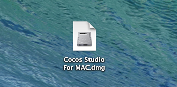

#Install

##Get  
Go to [http://www.cocos2d-x.org](http://www.cocos2d-x.org/download) to download the latest version, including Windows and MAC versions.

##Installed in "OS X"

- Select the MAC version of the installation package, click on the download to a local hard disk.
   
- After the download is complete, double click on [CocosStudio.dmg]() file.   
   
- Wait decompression 
   
- Double-click the icon Cocos Studio.pkg   
   
- Installation package description, click "Continue" to continue   
   
- Set installation options.  
   
	1. Click "Install" to install Cocos Studio. Installation process needs to enter an administrator password to continue.
	2. Click "Change Install Location .." modify the installation directory.
	3. Click "Go Back" to return to previous items.    
- After installation is complete,  in OS X's "Launchpad" will be able to see the following icons.   
   

##Frequently Asked Questions
- Q：Whether to provide the Windows version?   
	A：No MAC version provides synchronized version of Windows, until after MAC version was stable will be released simultaneously Windows version.

- Q：How to solve the installation fails？    
   A：Installation failed recommended to check whether there is enough disk space,Whether the password is correct.If you start the editor does not work properly, recommended to uninstall and install again .Get help from [Get Help page](../../contact_support/zh.md), when reinstalling not solve the problem.
