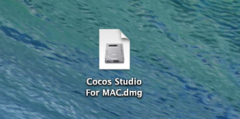
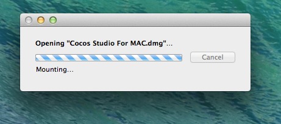
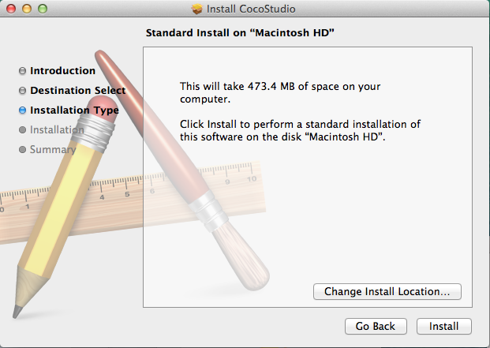

#安装

##获取   
前往[http://www.cocos2d-x.org](http://www.cocos2d-x.org/download)下载最新版本，包括Windows和MAC版本。

##OS X系统安装

- 选择MAC版本安装包，点击下载到本地硬盘。  
   
- 下载完成后，双击打开[CocosStudio.dmg]()文件。    
   
- 等待解压   
   
- 双击Cocos Studio.pkg图标   
   
- 安装包描述，点击“Continue”继续   
   
- 设置安装选项。  
   
	1. 点击“Install”安装Cocos Studio。安装过程中需要输入管理员密码才能继续。
	2. 点击“Change Install Location..”修改安装目录。
	3. 点击“Go Back”返回上一项。    
- 安装完成后，在OS X系统的“Launchpad”工具内将可以看到如下图标。   
   

##常见问题
- Q：是否提供Windows版本？   
	A：暂未提供与MAC版本同步的Windows版本，带MAC版本稳定后将同步发布Windows版本。可以现在原有Windows版本，功能会稍有不同。

- Q：安装失败如何解决？    
   A：安装失败建议检查是否有足够的硬盘控件，是否正确输入密码。如果您启动编辑器后无法正常运行，建议卸载后再次安装。如果重新安装未能解决问题，请从[获取帮助页面](../../contact_support/zh.md)获取帮助。

