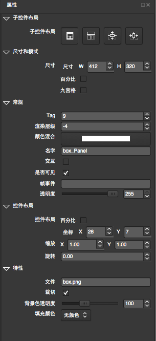

# Property Panel

## Overview

Properties panel is used to describe the properties of the currently selected control panel, and the main operation is controlled by the properties box to control, and real-time display in rendering area.At the same time in the other panel will also real-time response to the operation of the controls in the property box.

## Functionality
### General

For more information, see[widget General Property](3-3-16UIEditor-General-Property.md)。

### Size And Mode

For more information, see[widget General Property](3-3-16UIEditor-General-Property.md)。

### Layout

For more information, see[widget General Property](3-3-16UIEditor-General-Property.md)。

### Feature

Feature sets the widget's properties. Every widget will have its own unique properties. For more information, see each widget's detailed page in this List.

* [button]()
* [复选框]()
* [精灵]()
* [图片]()
* [数字标签]()
* [自定义字体]()
* [进度条]()
* [滑动条]()
* [文本框]()
* [输入框]()
* [层容器]()
* [滚动层容器]()
* [列表层容器]()
* [分页层容器]()

### Children Widget Layout

For more information, see[widget General Property](3-3-16UIEditor-General-Property.md)。
