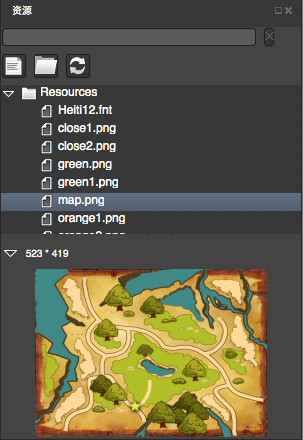

# Resource Panel

## Overview
------

Resource panel is used to manage project Resources, corresponding to the current project under the "Resources" folder, need to use in the current project Resources need to be fill added to the folder can be used in the editor.

- If the adjustment of resources in the editor, the editor will automatically refresh the list of resources.
- If it is through the system of resource done adjust, need to manually refresh the resources.

## Functions
-------
### Search

This function searches for the resource you wish to use. CocoStudio searches according to your input in the search field.

### Add File

1. Select files the from disk to import for use in CocoStudio. The multiple file import option is supported.

2. Files with duplicate names will not be imported.

### Add Folder
   
1. Select folder from the disk to import for use in CocoStudio.

2. Folders with duplicate names will not be imported.

### Refresh Resource

Select this option to refresh the list of resources in a project after manually deleting or adding a file or folder in the Resources folder.

### Preview Resource

Select any image resources, will be shown on the bottom of the preview area.By default, this preview area is folded, please click on the upper left corner of the triangle symbol to open.

### Drag and drop to the configuration of resources

The resource area *. PNG /. JPG drag and drop the file attribute to control box is complete control of configuration file attributes.
When the drag and drop to render area will automatically create a "spirit" control panel, and configure the texture rendering resources.

##  right-click menu 
------
### Open in Explorer
  
Opens selected file with  operating system.

### Rename

Renames resource name. Note that this option does not support the Plist & PSD image renaming function.   

### Delete

Deletes the selected resource.

### Import

- Import file

 Select files from the disk to import. The multiple file import option is supported.

-  Import folder

Select folder from the disk to import.

### Refresh Resource

Use this option to refresh the list of resources in a project when the user manually deletes or adds a file or a folder under the Resources folder.